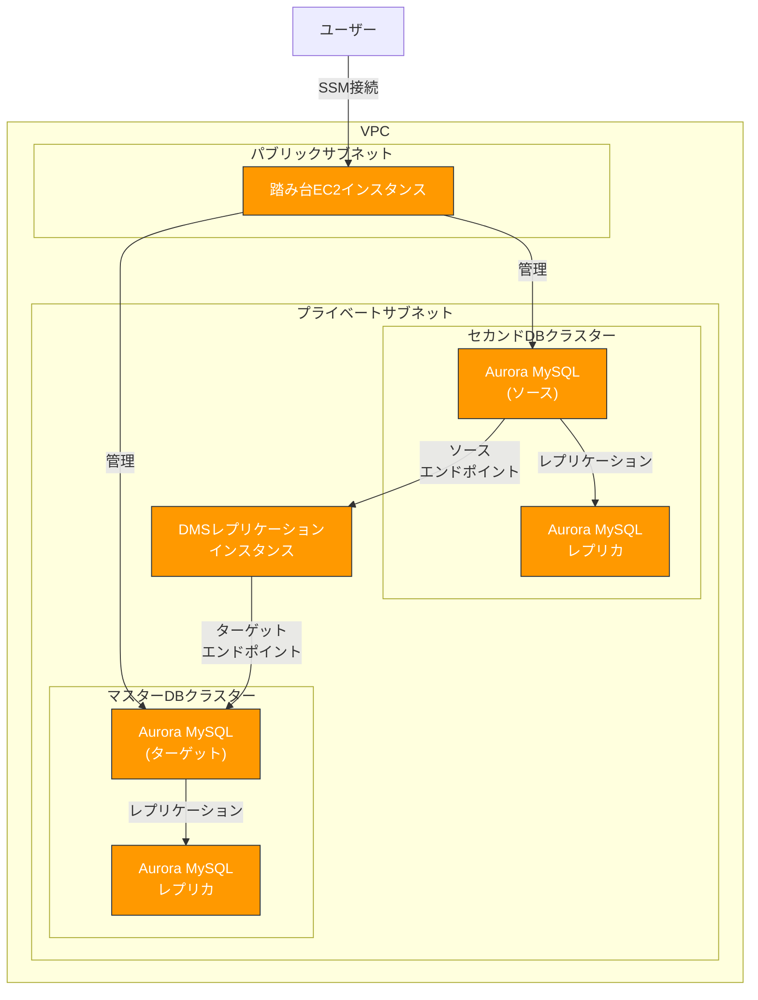

# AWS DMS レプリケーション検証環境

このリポジトリには、AWS DMS（Database Migration Service）を使用して、Aurora MySQL データベース間でのレプリケーションを設定するためのCloudFormationテンプレートとヘルパースクリプトが含まれています。

## アーキテクチャ概要



詳細なアーキテクチャについては、[アーキテクチャ概要](doc/architecture.md)を参照してください。

## 目次

- [環境構成](#環境構成)
- [クイックスタート](#クイックスタート)
- [詳細ドキュメント](#詳細ドキュメント)
- [ヘルパースクリプト](#ヘルパースクリプト)
- [注意事項](#注意事項)
- [クリーンアップ](#クリーンアップ)

## 環境構成

このソリューションは以下の2つのCloudFormationスタックで構成されています：

1. **templates/rds-replication.yaml** - 基本的なAurora MySQL環境（マスターDBとセカンドDB）を構築
2. **templates/dms-replication.yaml** - DMSレプリケーションを設定し、セカンドDBからマスターDBへのレプリケーションを構成

## クイックスタート

### ステップ1: 基本的なAurora MySQL環境をデプロイ

```bash
aws cloudformation deploy \
  --template-file templates/rds-replication.yaml \
  --stack-name aurora-mysql-env \
  --parameter-overrides \
    DBUsername=admin \
    DBPassword=YourStrongPassword \
    MasterDBName=hogedb \
    SecondDBName=fugadb \
  --capabilities CAPABILITY_IAM
```

### ステップ2: サンプルデータベースをインポート

踏み台サーバーにSSM経由で接続し、サンプルデータベースをインポートします。

```bash
# SSM経由で踏み台サーバーに接続
aws ssm start-session --target $(aws cloudformation describe-stacks --stack-name aurora-mysql-env --query "Stacks[0].Outputs[?OutputKey=='BastionInstanceId'].OutputValue" --output text)

# 踏み台サーバー上で以下を実行
chmod +x scripts/import_sample_db.sh
./scripts/import_sample_db.sh aurora-mysql-env
```

### ステップ3: DMSレプリケーションをデプロイ

```bash
aws cloudformation deploy \
  --template-file templates/dms-replication.yaml \
  --stack-name dms-replication \
  --parameter-overrides \
    ExistingStackName=aurora-mysql-env \
    DBUsername=admin \
    DBPassword=YourStrongPassword \
    SourceDatabaseName=world \
  --capabilities CAPABILITY_IAM
```

### ステップ4: レプリケーションを検証

踏み台サーバーでレプリケーション検証スクリプトを実行します。

```bash
# 踏み台サーバー上で以下を実行
chmod +x scripts/verify_replication.sh
./scripts/verify_replication.sh aurora-mysql-env
```

詳細な手順については、[デプロイガイド](doc/deployment-guide.md)を参照してください。

## 詳細ドキュメント

- [アーキテクチャ概要](doc/architecture.md) - ソリューションのアーキテクチャと構成要素の詳細
- [CloudFormationテンプレート](doc/cloudformation-templates.md) - テンプレートの詳細な説明
- [ヘルパースクリプト](doc/helper-scripts.md) - 各スクリプトの機能と使用方法
- [デプロイガイド](doc/deployment-guide.md) - 詳細なデプロイ手順とトラブルシューティング

## ヘルパースクリプト

このリポジトリには以下のヘルパースクリプトが含まれています：

1. **scripts/import_sample_db.sh** - サンプルデータベース（WorldとEmployees）をセカンドDBにインポートし、マスターDBに空のWorldデータベースを作成
2. **scripts/verify_replication.sh** - レプリケーションが正常に機能しているかを検証
3. **scripts/manage_dms_task.sh** - DMSタスクの管理（開始、停止、ステータス確認、再起動）

スクリプトの詳細については、[ヘルパースクリプト](doc/helper-scripts.md)を参照してください。

## DMSタスクの管理

DMSタスクを管理するには、以下のコマンドを使用します：

```bash
# タスクのステータスを確認
./scripts/manage_dms_task.sh dms-replication status

# タスクを停止
./scripts/manage_dms_task.sh dms-replication stop

# タスクを開始
./scripts/manage_dms_task.sh dms-replication start

# タスクを再起動
./scripts/manage_dms_task.sh dms-replication restart
```

## 注意事項

1. **バイナリログの有効化**: レプリケーションを機能させるためには、セカンドDBでバイナリログが有効になっている必要があります。既存のテンプレートではこれが設定されていることを前提としています。

2. **データベースユーザー権限**: レプリケーションに使用するデータベースユーザーには、適切な権限（REPLICATION CLIENT, REPLICATION SLAVE）が必要です。

3. **コスト**: DMSインスタンスとAurora MySQLクラスターは料金が発生します。不要になった場合は、スタックを削除してください。

## クリーンアップ

環境を削除するには、以下の順序でスタックを削除します：

```bash
# 1. DMSレプリケーションスタックを削除
aws cloudformation delete-stack --stack-name dms-replication

# 2. Aurora MySQL環境スタックを削除
aws cloudformation delete-stack --stack-name aurora-mysql-env
```