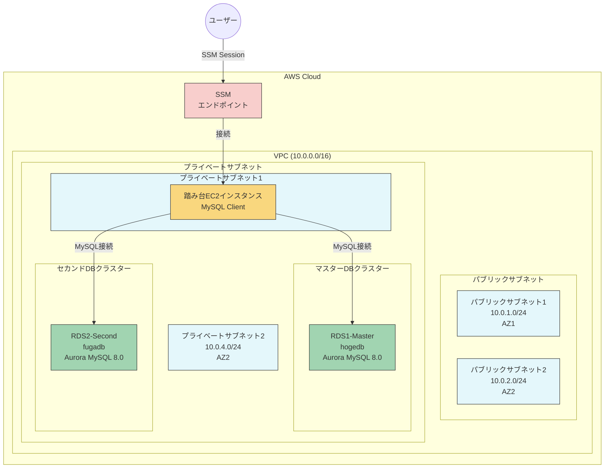

# RDSレプリケーション検証環境

## 概要

このプロジェクトはAWS RDSインスタンス間のレプリケーション検証環境を簡単に構築・管理するためのツールを提供します。補助スクリプト `run.sh` を使用することで、複雑なAWS CLIコマンドを実行することなく、環境の構築から操作までをシンプルに行うことができます。

## 構成

- VPC、サブネット、セキュリティグループなどのネットワークリソース
- 2つのRDSインスタンス（MySQL 8.0.28）
  - マスターDB: `hogedb`（デフォルト、変更可能）
  - セカンドDB: `fugadb`（デフォルト、変更可能）
- SSM接続可能な踏み台EC2インスタンス
  - プライベートサブネットに配置
  - MySQLクライアントがプリインストール済み

## 構成図



## 前提条件

- AWS CLIがインストールされていること
- AWS認証情報が設定されていること
- CloudFormationスタックを作成するための適切なIAM権限があること
- SSMセッションマネージャーを使用するための権限があること
- SSMセッションマネージャープラグインがインストールされていること（ポートフォワーディング機能を使用する場合）

## クイックスタート

```bash
# 1. スクリプトに実行権限を付与
chmod +x run.sh

# 2. スタックをデプロイ（約15-20分かかります）
./run.sh deploy --db-password YourSecurePassword123

# 3. スタックのステータスを確認
./run.sh status

# 4. 踏み台EC2インスタンスに接続
./run.sh connect-ec2

# 5. マスターDBへのポートフォワーディングを設定
./run.sh port-forward-master

# 6. 使用後はリソースを削除
./run.sh delete
```

## 詳細な使い方

### 1. 環境のセットアップ

まず、スクリプトに実行権限を付与します：

```bash
chmod +x run.sh
```

ヘルプを表示して、利用可能なコマンドを確認できます：

```bash
./run.sh help
```

### 2. 環境のデプロイ

最小限の設定でデプロイする場合（DBパスワードのみ指定）：

```bash
./run.sh deploy --db-password YourSecurePassword123
```

カスタム設定でデプロイする場合：

```bash
./run.sh deploy \
  --db-password YourSecurePassword123 \
  --db-username customadmin \
  --master-db-name masterdb \
  --second-db-name seconddb \
  --db-instance-class db.t3.small \
  --ec2-instance-type t3.small
```

### 3. 環境の管理

スタックのステータスを確認：

```bash
./run.sh status
```

スタックの出力値（エンドポイントなど）を表示：

```bash
./run.sh outputs
```

スタックを更新（パスワードを変更）：

```bash
./run.sh update --db-password NewPassword123
```

スタックを更新（EC2インスタンスタイプのみ変更、既存のパスワードを使用）：

```bash
./run.sh update --use-previous-password --ec2-instance-type t3.small
```

スタックを削除（すべてのリソースを削除）：

```bash
./run.sh delete
```

### 4. データベースへのアクセス

#### 踏み台EC2インスタンスに直接接続

```bash
./run.sh connect-ec2
```

接続後、EC2インスタンス上で以下のコマンドを実行してデータベースに接続できます：

```bash
# マスターDBに接続
mysql -h $(cat /home/ec2-user/db-scripts/db_info.txt | grep MASTER_ENDPOINT | cut -d'=' -f2) -u admin -p hogedb

# または、作成済みのエイリアスを使用
master-db

# セカンドDBに接続
mysql -h $(cat /home/ec2-user/db-scripts/db_info.txt | grep SECOND_ENDPOINT | cut -d'=' -f2) -u admin -p fugadb

# または、作成済みのエイリアスを使用
second-db
```

#### ローカルマシンからデータベースに接続（ポートフォワーディング）

マスターDBへのポートフォワーディングを設定（デフォルトはローカルポート3306）：

```bash
./run.sh port-forward-master
```

セカンドDBへのポートフォワーディングを設定（デフォルトはローカルポート3307）：

```bash
./run.sh port-forward-second
```

カスタムローカルポートを指定してポートフォワーディング：

```bash
./run.sh port-forward-master --local-port 13306
./run.sh port-forward-second --local-port 13307
```

ポートフォワーディングが確立されたら、別のターミナルウィンドウで以下のコマンドを実行してRDSに接続できます：

```bash
# マスターDBへの接続
mysql -h 127.0.0.1 -P 3306 -u admin -p hogedb

# セカンドDBへの接続
mysql -h 127.0.0.1 -P 3307 -u admin -p fugadb
```

## パラメータ一覧

### deployコマンドのパラメータ

| パラメータ | 説明 | デフォルト値 | 必須 |
|------------|------|------------|------|
| `--db-password` | データベースのパスワード | - | はい |
| `--db-username` | データベースのユーザー名 | admin | いいえ |
| `--master-db-name` | マスターデータベース名 | hogedb | いいえ |
| `--second-db-name` | セカンドデータベース名 | fugadb | いいえ |
| `--db-instance-class` | DBインスタンスクラス | db.t3.medium | いいえ |
| `--ec2-instance-type` | EC2インスタンスタイプ | t3.micro | いいえ |

### updateコマンドの追加パラメータ

| パラメータ | 説明 |
|------------|------|
| `--use-previous-password` | 既存のDBパスワードを使用 |
| `--use-previous-username` | 既存のDBユーザー名を使用 |
| `--use-previous-master-db-name` | 既存のマスターDB名を使用 |
| `--use-previous-second-db-name` | 既存のセカンドDB名を使用 |
| `--use-previous-db-instance-class` | 既存のDBインスタンスクラスを使用 |
| `--use-previous-ec2-instance-type` | 既存のEC2インスタンスタイプを使用 |

## トラブルシューティング

1. **接続エラー**: EC2インスタンスがRDSエンドポイントに到達できることを確認してください。セキュリティグループの設定を確認します。

2. **権限エラー**: AWS CLIの認証情報と、SSMセッションマネージャーを使用するための適切なIAM権限があることを確認してください。

3. **ポートの競合**: ローカルポートが既に使用されている場合は、`--local-port` オプションで別のポート番号を指定してください。

4. **Session Managerプラグインのエラー**: プラグインが正しくインストールされていることを確認してください。インストール方法は[AWS公式ドキュメント](https://docs.aws.amazon.com/systems-manager/latest/userguide/session-manager-working-with-install-plugin.html)を参照してください。

5. **スタックの作成/更新エラー**: `./run.sh status` コマンドを実行して詳細なエラーメッセージを確認してください。

## 注意事項

- このプロジェクトは検証環境用です。本番環境で使用する場合は、適切なセキュリティ設定を行ってください。
- 使用後はリソースを削除して、不要な料金が発生しないようにしてください。
- RDSインスタンスは料金が発生します。特にdb.t3.mediumクラスは比較的コストが高いため、長時間の使用には注意してください。