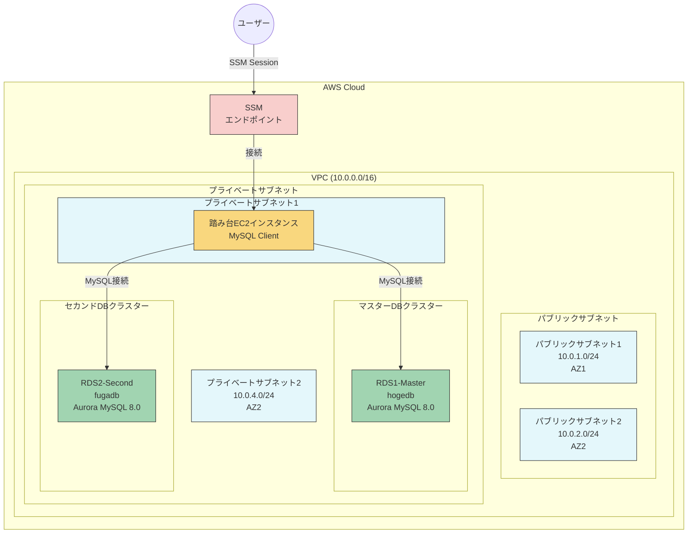

# RDSレプリケーション検証環境

## 概要

このプロジェクトはAWS RDSインスタンス間のレプリケーション検証環境を構築するためのCloudFormationテンプレートを提供します。

## 構成

- VPC、サブネット、セキュリティグループなどのネットワークリソース
- 2つのRDSインスタンス（MySQL 8.0.28）
  - マスターDB: `hogedb`
  - セカンドDB: `fugadb`
- SSM接続可能な踏み台EC2インスタンス
  - プライベートサブネットに配置
  - MySQLクライアントがプリインストール済み

## 構成図



## 前提条件

- AWS CLIがインストールされていること
- AWS認証情報が設定されていること
- CloudFormationスタックを作成するための適切なIAM権限があること
- SSMセッションマネージャーを使用するための権限があること

## 使い方

### CloudFormationスタックのデプロイ

以下のAWS CLIコマンドを使用してCloudFormationスタックをデプロイします：

```bash
aws cloudformation create-stack \
  --stack-name rds-replication-stack \
  --template-body file://rds-replication.yaml \
  --parameters ParameterKey=DBPassword,ParameterValue=YOUR_PASSWORD_HERE \
  --capabilities CAPABILITY_IAM
```

パラメータの説明：
- `--stack-name`: スタックの名前を指定します
- `--template-body`: テンプレートファイルのパスを指定します
- `--parameters`: テンプレートのパラメータを指定します（少なくともDBPasswordは必須）
- `--capabilities`: 必要な機能を指定します（IAMリソース作成のため必須）

### CloudFormationスタックの更新

テンプレートを変更した後、以下のコマンドでスタックを更新できます：

```bash
aws cloudformation update-stack \
  --stack-name rds-replication-stack \
  --template-body file://rds-replication.yaml \
  --parameters ParameterKey=DBPassword,ParameterValue=YOUR_PASSWORD_HERE \
  --capabilities CAPABILITY_IAM
```

既存のパラメータ値を再利用する場合（新しく追加されたパラメータには値を指定）：

```bash
aws cloudformation update-stack \
  --stack-name rds-replication-stack \
  --template-body file://rds-replication.yaml \
  --parameters ParameterKey=DBPassword,UsePreviousValue=true \
               ParameterKey=MasterDBName,UsePreviousValue=true \
               ParameterKey=SecondDBName,UsePreviousValue=true \
               ParameterKey=DBInstanceClass,UsePreviousValue=true \
               ParameterKey=DBUsername,UsePreviousValue=true \
               ParameterKey=EC2InstanceType,ParameterValue=t3.micro \
               ParameterKey=LatestAmiId,ParameterValue=/aws/service/ami-amazon-linux-latest/amzn2-ami-hvm-x86_64-gp2 \
  --capabilities CAPABILITY_IAM
```

注意: 新しく追加されたパラメータ（EC2InstanceTypeやLatestAmiIdなど）には`UsePreviousValue=true`を指定できません。これらには明示的に値を指定する必要があります。

変更セットを使用した更新（推奨）：

```bash
# 変更セットの作成
aws cloudformation create-change-set \
  --stack-name rds-replication-stack \
  --change-set-name update-rds-replication \
  --template-body file://rds-replication.yaml \
  --parameters ParameterKey=DBPassword,ParameterValue=YOUR_PASSWORD_HERE \
               ParameterKey=MasterDBName,UsePreviousValue=true \
               ParameterKey=SecondDBName,UsePreviousValue=true \
               ParameterKey=DBInstanceClass,UsePreviousValue=true \
               ParameterKey=DBUsername,UsePreviousValue=true \
               ParameterKey=EC2InstanceType,ParameterValue=t3.micro \
               ParameterKey=LatestAmiId,ParameterValue=/aws/service/ami-amazon-linux-latest/amzn2-ami-hvm-x86_64-gp2 \
  --capabilities CAPABILITY_IAM

# 変更セットの内容確認
aws cloudformation describe-change-set \
  --stack-name rds-replication-stack \
  --change-set-name update-rds-replication

# 変更セットの実行
aws cloudformation execute-change-set \
  --stack-name rds-replication-stack \
  --change-set-name update-rds-replication
```

注意事項：
- 一部のリソース変更は置き換えが必要となり、ダウンタイムが発生する可能性があります
- 更新前にテンプレートの変更内容を十分に確認してください
- 重要なデータがある場合は、事前にバックアップを取得してください

### スタックの進行状況の確認

```bash
aws cloudformation describe-stacks --stack-name rds-replication-stack
```

### スタックの出力の取得

デプロイが完了したら、以下のコマンドでRDSエンドポイントなどの出力値を取得できます：

```bash
aws cloudformation describe-stacks \
  --stack-name rds-replication-stack \
  --query "Stacks[0].Outputs"
```

### EC2踏み台サーバーへの接続

SSMセッションマネージャーを使用して踏み台サーバーに接続します：

```bash
# スタック出力から取得したコマンドを使用
aws ssm start-session --target i-xxxxxxxxxxxxxxxxx
```

### RDSへの接続

踏み台サーバーに接続後、以下のコマンドでRDSインスタンスに接続できます：

```bash
# マスターDBへの接続
mysql -h <マスターDBエンドポイント> -u admin -p hogedb

# セカンドDBへの接続
mysql -h <セカンドDBエンドポイント> -u admin -p fugadb
```

### スタックの削除

検証が終了したら、以下のコマンドでスタックを削除できます：

```bash
aws cloudformation delete-stack --stack-name rds-replication-stack
```

## パラメータ

テンプレートでは以下のパラメータをカスタマイズできます：

- `MasterDBName`: マスターデータベース名（デフォルト: hogedb）
- `SecondDBName`: 2つ目のRDSインスタンス上のデータベース名（デフォルト: fugadb）
- `DBInstanceClass`: DBインスタンスクラス（デフォルト: db.t3.medium）
- `DBUsername`: データベース管理者ユーザー名（デフォルト: admin）
- `DBPassword`: データベース管理者パスワード（必須）
- `EC2InstanceType`: 踏み台サーバーのインスタンスタイプ（デフォルト: t3.micro）
- `LatestAmiId`: 踏み台サーバーのAMI ID（デフォルト: 最新のAmazon Linux 2）

## 注意事項

- このテンプレートはテスト・検証用途を想定しています
- 本番環境での使用には適切なセキュリティ設定を追加してください
- RDSインスタンスとEC2インスタンスには料金が発生します。使用後は忘れずに削除してください
- EC2インスタンスはプライベートサブネットに配置されており、インターネットアクセスはありません
- SSM接続のためのVPCエンドポイントが設定されています

## SSMポートフォワーディングを使用したRDSへの接続

SSMポートフォワーディングを使用すると、ローカルマシンから直接RDSインスタンスに接続できます。これにより、踏み台サーバーにログインせずにRDSにアクセスできます。

### 前提条件

- AWS CLIがインストールされていること
- AWS Session Managerプラグインがインストールされていること
  ```bash
  # macOSの場合
  brew install --cask session-manager-plugin

  # Amazon Linux/RHEL/CentOSの場合
  curl "https://s3.amazonaws.com/session-manager-downloads/plugin/latest/linux_64bit/session-manager-plugin.rpm" -o "session-manager-plugin.rpm"
  sudo yum install -y session-manager-plugin.rpm

  # Ubuntuの場合
  curl "https://s3.amazonaws.com/session-manager-downloads/plugin/latest/ubuntu_64bit/session-manager-plugin.deb" -o "session-manager-plugin.deb"
  sudo dpkg -i session-manager-plugin.deb

  # Windowsの場合
  # https://docs.aws.amazon.com/systems-manager/latest/userguide/session-manager-working-with-install-plugin.html からインストーラーをダウンロード
  ```

### ポートフォワーディングの設定

1. EC2インスタンスIDを取得します：

```bash
aws cloudformation describe-stacks \
  --stack-name rds-replication-stack \
  --query "Stacks[0].Outputs[?OutputKey=='BastionInstanceId'].OutputValue" \
  --output text
```

2. RDSエンドポイントを取得します：

```bash
# マスターDBエンドポイント
aws cloudformation describe-stacks \
  --stack-name rds-replication-stack \
  --query "Stacks[0].Outputs[?OutputKey=='MasterDBEndpoint'].OutputValue" \
  --output text

# セカンドDBエンドポイント
aws cloudformation describe-stacks \
  --stack-name rds-replication-stack \
  --query "Stacks[0].Outputs[?OutputKey=='SecondDBEndpoint'].OutputValue" \
  --output text
```

3. SSMポートフォワーディングを開始します：

```bash
# マスターDBへのポートフォワーディング（ローカルポート3306をRDSの3306に転送）
aws ssm start-session \
  --target インスタンスID \
  --document-name AWS-StartPortForwardingSessionToRemoteHost \
  --parameters '{"host":["マスターDBエンドポイント"],"portNumber":["3306"], "localPortNumber":["3306"]}'

# セカンドDBへのポートフォワーディング（ローカルポート3307をRDSの3306に転送）
aws ssm start-session \
  --target インスタンスID \
  --document-name AWS-StartPortForwardingSessionToRemoteHost \
  --parameters '{"host":["セカンドDBエンドポイント"],"portNumber":["3306"], "localPortNumber":["3307"]}'
```

注意: ローカルの3306ポートが既に使用されている場合は、別のポート（例：13306）を指定してください。

### 具体的なコマンド例

以下は、このプロジェクトのCloudFormationスタックがデプロイされている場合の具体的なコマンド例です：

```bash
# マスターDBへのポートフォワーディング
aws ssm start-session \
  --target i-0c260e5025fe80a03 \
  --document-name AWS-StartPortForwardingSessionToRemoteHost \
  --parameters '{"host":["rds-replication-stack-masterdbcluster-gnsrcbaxedjc.cluster-chopxyypdptr.ap-northeast-1.rds.amazonaws.com"],"portNumber":["3306"], "localPortNumber":["3306"]}'

# セカンドDBへのポートフォワーディング
aws ssm start-session \
  --target i-0c260e5025fe80a03 \
  --document-name AWS-StartPortForwardingSessionToRemoteHost \
  --parameters '{"host":["rds-replication-stack-seconddbcluster-pi2iozlfbgyh.cluster-chopxyypdptr.ap-northeast-1.rds.amazonaws.com"],"portNumber":["3306"], "localPortNumber":["3307"]}'
```

ポートフォワーディングが確立されたら、別のターミナルウィンドウで以下のコマンドを実行してRDSに接続できます：

```bash
# マスターDBへの接続
mysql -h 127.0.0.1 -P 3306 -u admin -p hogedb

# セカンドDBへの接続
mysql -h 127.0.0.1 -P 3307 -u admin -p fugadb
```

4. 別のターミナルウィンドウで、ローカルホストを通じてRDSに接続します：

```bash
# マスターDBへの接続（ローカルポート3306経由）
mysql -h 127.0.0.1 -P 3306 -u admin -p hogedb

# セカンドDBへの接続（ローカルポート3307経由）
mysql -h 127.0.0.1 -P 3307 -u admin -p fugadb
```

### ポートフォワーディングの終了

ポートフォワーディングを終了するには、セッションを実行しているターミナルで `Ctrl+C` を押します。

### トラブルシューティング

1. **接続エラー**: EC2インスタンスがRDSエンドポイントに到達できることを確認してください。セキュリティグループの設定を確認します。

2. **権限エラー**: AWS CLIの認証情報と、SSMセッションマネージャーを使用するための適切なIAM権限があることを確認してください。

3. **ポートの競合**: ローカルポートが既に使用されている場合は、別のポート番号を指定してください。

4. **Session Managerプラグインのエラー**: プラグインが正しくインストールされていることを確認してください。