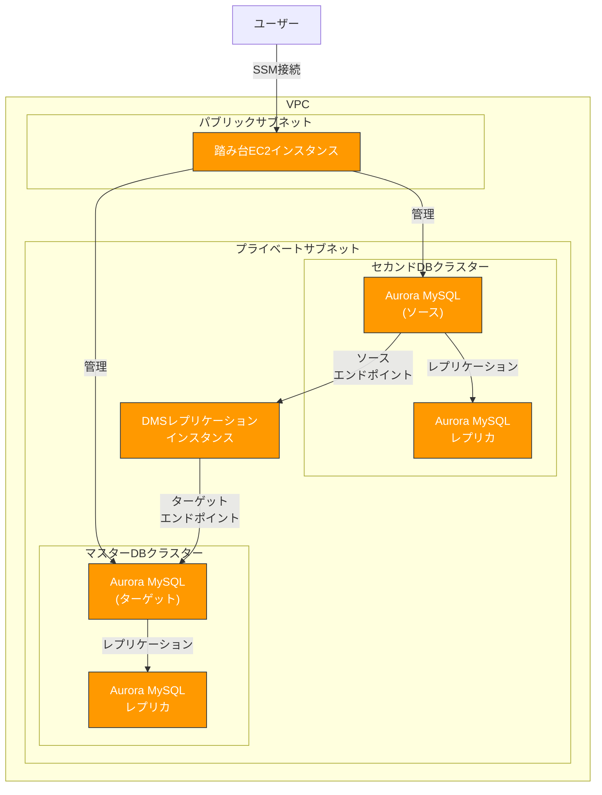

# AWS DMS レプリケーション検証環境

このリポジトリには、AWS DMS（Database Migration Service）を使用して、Aurora MySQL データベース間でのレプリケーションを設定するためのCloudFormationテンプレートとヘルパースクリプトが含まれています。

## アーキテクチャ概要



詳細なアーキテクチャについては、[アーキテクチャ概要](doc/architecture.md)を参照してください。

## 目次

- [環境構成](#環境構成)
- [クイックスタート](#クイックスタート)
- [詳細ドキュメント](#詳細ドキュメント)
- [ヘルパースクリプト](#ヘルパースクリプト)
- [注意事項](#注意事項)
- [クリーンアップ](#クリーンアップ)

## 環境構成

このソリューションは以下の2つのCloudFormationスタックで構成されています：

1. **templates/rds-replication.yaml** - 基本的なAurora MySQL環境（マスターDBとセカンドDB）を構築
2. **templates/dms-replication.yaml** - DMSレプリケーションを設定し、セカンドDBからマスターDBへのレプリケーションを構成

## クイックスタート

このセクションでは、AWS DMSを使用したAurora MySQL間のレプリケーション環境を素早く構築する手順を説明します。

### ステップ1: 基本的なAurora MySQL環境をデプロイ

以下のコマンドを実行して、2つのAurora MySQLクラスターと踏み台サーバーを含む基本的な環境をデプロイします。

```bash
./run.sh deploy --db-password YourStrongPassword
```

デプロイには約15〜20分かかります。デプロイの進行状況は以下のコマンドで確認できます：

```bash
./run.sh status
```

### ステップ2: サンプルデータベースをインポート

サンプルデータベースをローカルからインポートするには、以下の手順に従います：

1. 2つのターミナルウィンドウを開き、それぞれでポートフォワーディングを設定します：

ターミナル1（マスターDB用）:
```bash
./run.sh port-forward-master --local-port 13306
```

ターミナル2（セカンドDB用）:
```bash
./run.sh port-forward-second --local-port 13307
```

2. 3つ目のターミナルウィンドウで、以下のコマンドを実行してサンプルデータベースをインポートします：

```bash
./run.sh import-sample-db --master-port 13306 --second-port 13307
```

このスクリプトは以下の処理を行います：
- セカンドDBに以下のデータベースをインポート：
  - `world` データベース（レプリケーション対象）
  - `worldnonrepl` データベース（レプリケーション非対象）
- マスターDBに空の `world` データベースを作成（レプリケーションのターゲット）

### ステップ3: DMSレプリケーションをデプロイ

サンプルデータベースのインポートが完了したら、DMSレプリケーションをデプロイします。

```bash
./run.sh deploy-dms --db-password YourStrongPassword
```

デプロイには約10〜15分かかります。デプロイの進行状況は以下のコマンドで確認できます：

```bash
./run.sh status-dms
```

### ステップ4: レプリケーションを検証

DMSレプリケーションのデプロイが完了したら、レプリケーションが正常に機能しているかを検証します。

```bash
./run.sh verify-replication --master-port 13306 --second-port 13307
```

このスクリプトは以下の検証を行います：
- `world` データベースがレプリケーションされているか確認
- `worldnonrepl` データベースがレプリケーションされていないか確認
- 継続的なレプリケーションをテスト（新しい行を挿入して複製されるか確認）

### ステップ5: DMSタスクの管理

DMSタスクを管理するには、以下のコマンドを使用します：

```bash
# タスクのステータスを確認
./run.sh status-dms

# タスクを停止
./run.sh stop-dms

# タスクを開始
./run.sh start-dms

# タスクを再起動
./run.sh restart-dms
```

## 詳細ドキュメント

- [アーキテクチャ概要](doc/architecture.md) - ソリューションのアーキテクチャと構成要素の詳細
- [CloudFormationテンプレート](doc/cloudformation-templates.md) - テンプレートの詳細な説明
- [ヘルパースクリプト](doc/helper-scripts.md) - 各スクリプトの機能と使用方法
- [デプロイガイド](doc/deployment-guide.md) - 詳細なデプロイ手順とトラブルシューティング

## ヘルパースクリプト

このリポジトリには以下のヘルパースクリプトが含まれています：

1. **scripts/import_sample_db.sh** - サンプルデータベース（World）をセカンドDBにインポートし、マスターDBに空のWorldデータベースを作成
2. **scripts/verify_replication.sh** - レプリケーションが正常に機能しているかを検証
3. **scripts/manage_dms_task.sh** - DMSタスクの管理（開始、停止、ステータス確認、再起動）

スクリプトの詳細については、[ヘルパースクリプト](doc/helper-scripts.md)を参照してください。

## 注意事項

1. **バイナリログの有効化**: レプリケーションを機能させるためには、セカンドDBでバイナリログが有効になっている必要があります。既存のテンプレートではこれが設定されていることを前提としています。

2. **データベースユーザー権限**: レプリケーションに使用するデータベースユーザーには、適切な権限（REPLICATION CLIENT, REPLICATION SLAVE）が必要です。

3. **コスト**: DMSインスタンスとAurora MySQLクラスターは料金が発生します。不要になった場合は、スタックを削除してください。

## クリーンアップ

環境を削除するには、以下の順序でスタックを削除します：

```bash
# 1. DMSレプリケーションスタックを削除
./run.sh delete-dms

# 2. Aurora MySQL環境スタックを削除
./run.sh delete
```

これにより、すべてのリソースが適切に削除され、AWS上で不要な料金が発生しなくなります。