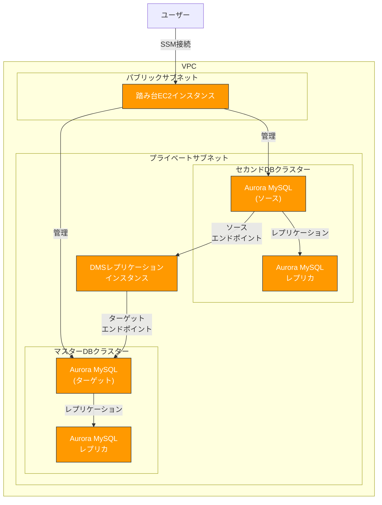

# アーキテクチャ概要

このプロジェクトは、AWS DMSを使用してAurora MySQL間でのレプリケーションを実現するためのアーキテクチャを提供します。

## 全体アーキテクチャ

## コンポーネント構成

このソリューションは以下の主要コンポーネントで構成されています：

### 1. ネットワーク層

- **VPC**: すべてのリソースを配置するプライベートネットワーク環境
- **パブリックサブネット**: インターネットゲートウェイを介してインターネットにアクセス可能なサブネット（2つのAZ）
- **プライベートサブネット**: インターネットから直接アクセスできないサブネット（2つのAZ）
- **セキュリティグループ**: リソース間の通信を制御するファイアウォール

### 2. データベース層

- **マスターDBクラスター**: レプリケーションのターゲットとなるAurora MySQLクラスター
  - データベース名: hogedb（デフォルト）
  - エンジン: Aurora MySQL 8.0
  - マルチAZ配置: 有効

- **セカンドDBクラスター**: レプリケーションのソースとなるAurora MySQLクラスター
  - データベース名: fugadb（デフォルト）
  - エンジン: Aurora MySQL 8.0
  - マルチAZ配置: 有効

### 3. レプリケーション層

- **DMSレプリケーションインスタンス**: レプリケーションを実行するインスタンス
  - インスタンスクラス: dms.t3.medium（デフォルト）
  - ストレージ: 50GB
  - マルチAZ: 無効（テスト環境のため）

- **DMSエンドポイント**:
  - ソースエンドポイント: セカンドDBを指す
  - ターゲットエンドポイント: マスターDBを指す

- **DMSレプリケーションタスク**:
  - 移行タイプ: 全ロードおよび継続的な変更のキャプチャ（full-load-and-cdc）
  - テーブルマッピング: worldスキーマのみをレプリケート、employeesスキーマを除外

### 4. 管理層

- **踏み台EC2インスタンス**: データベースへのアクセスとレプリケーションの管理を行うためのサーバー
  - インスタンスタイプ: t3.micro（デフォルト）
  - 接続方法: SSMセッションマネージャー
  - プリインストールツール: MySQL Client, AWS CLI

## データフロー

1. セカンドDB（ソース）でデータが変更される
2. DMSレプリケーションインスタンスがバイナリログから変更を検出
3. 変更がマスターDB（ターゲット）に適用される

## セキュリティ考慮事項

- すべてのデータベースはプライベートサブネットに配置され、インターネットから直接アクセスできない
- 踏み台サーバーへのアクセスはSSMセッションマネージャーを介してのみ可能
- データベース間の通信はVPC内に限定される
- Aurora DBクラスターのストレージは暗号化される（オプション）

## スケーラビリティ

- Aurora MySQLクラスターは需要に応じてスケールアップ/ダウン可能
- DMSレプリケーションインスタンスは、より大きなインスタンスクラスにアップグレード可能
- 本番環境では、DMSレプリケーションインスタンスをマルチAZ配置にすることで可用性を向上させることが可能

## 制限事項

- このアーキテクチャはテスト/検証環境向けに設計されています
- 本番環境で使用する場合は、セキュリティとパフォーマンスの観点から追加の設定が必要になる場合があります
- DMSはすべてのデータ型やデータベース機能をサポートしているわけではありません